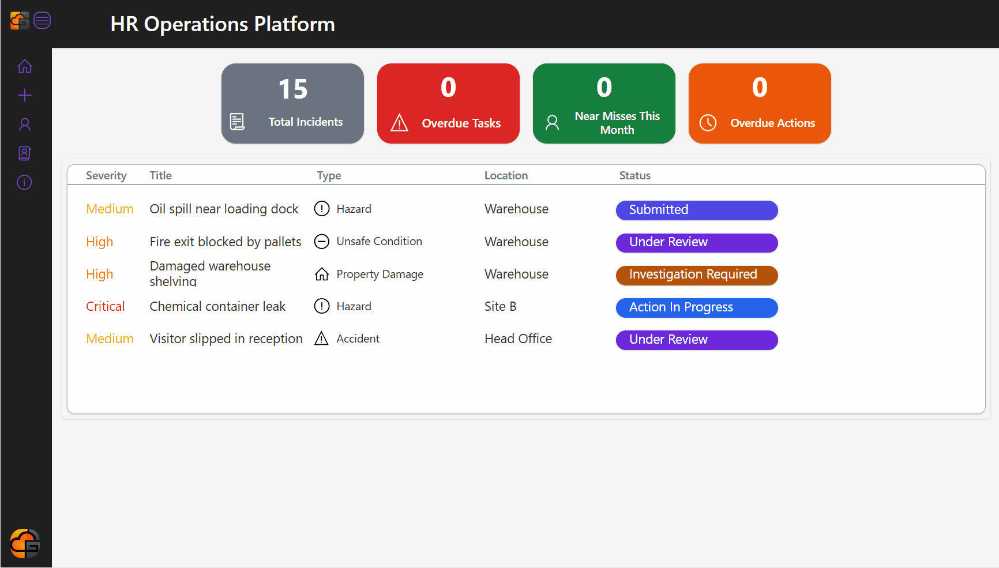
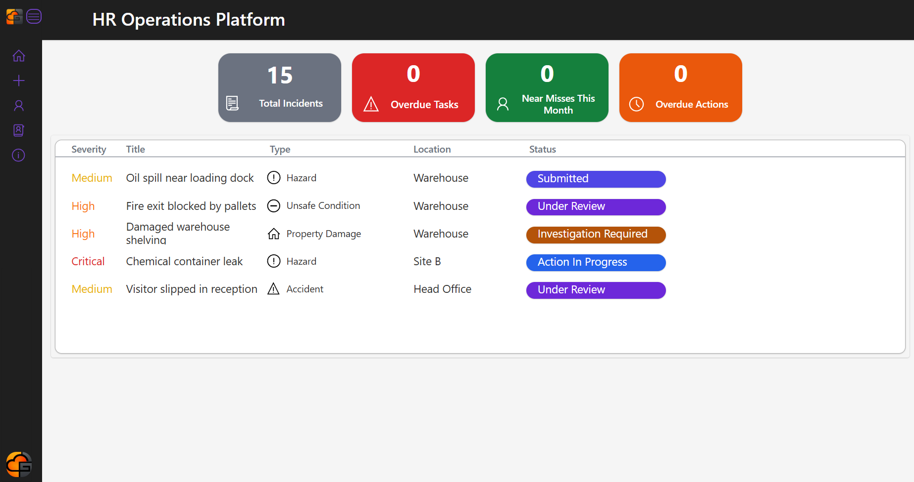
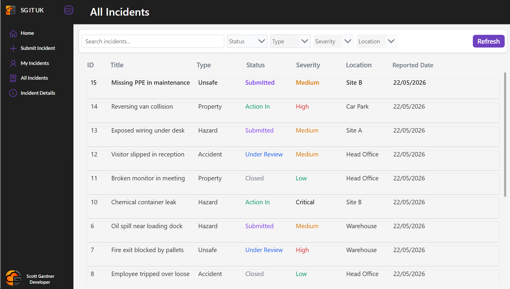
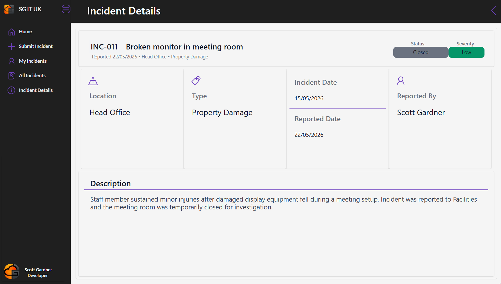
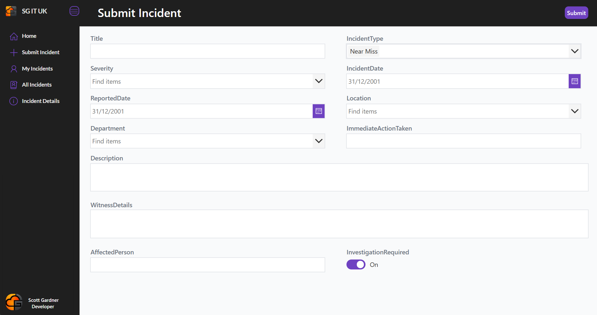
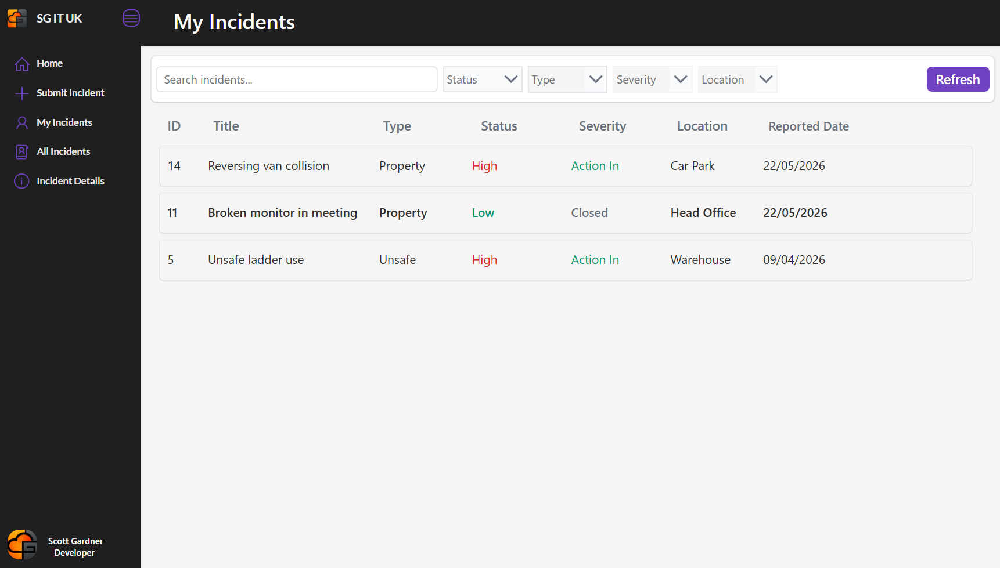

# Enterprise Incident Management Platform

Built using Microsoft Power Apps, SharePoint Online, Power Automate, and Microsoft 365.

An enterprise-style incident management solution designed to streamline operational incident reporting, investigation workflows, corrective actions, and KPI monitoring within a Microsoft 365 environment.

---

## 🎬 Demo



---

## 🚀 Overview

The Enterprise Incident Management Platform is a Microsoft Power Platform solution designed to streamline incident reporting, investigation, and operational tracking within an enterprise environment.

Built using Power Apps, SharePoint Online, Power Automate, and Microsoft 365, the platform enables users to submit incidents, monitor progress, track corrective actions, and manage investigations through a modern responsive interface.

The solution was designed to replicate a real-world enterprise health & safety / operations management system with dashboard reporting, filtering, lifecycle tracking, and role-based functionality.

---

## ✨ Key Features

### Incident Management
- Submit and manage operational incidents
- Track incident lifecycle from submission to closure
- Support for multiple incident types:
  - Hazards
  - Near Misses
  - Unsafe Conditions
  - Property Damage
  - Accidents

### Dashboard & KPI Reporting
- Real-time KPI dashboard
- Total incidents tracking
- Overdue tasks monitoring
- Near miss reporting
- Outstanding corrective actions

### Search & Filtering
- Delegation-friendly filtering
- Dynamic search functionality
- Multi-filter support:
  - Status
  - Severity
  - Type
  - Location

### Role-Based Experience
- Users can view their own incidents
- Operational management view for all incidents
- Structured incident detail pages

### Incident Investigation Workflow
- Investigation status tracking
- Corrective action management
- Priority and severity classification
- Status progression workflows

### Responsive Enterprise UI
- Responsive container-based layouts
- Modern enterprise-style interface
- Custom navigation sidebar
- Consistent status colour system
- Optimised user experience across screen sizes

---

## 🛠 Technology Stack

| Technology | Purpose |
|---|---|
| Microsoft Power Apps | Front-end application |
| SharePoint Online | Data storage & management |
| Power Automate | Workflow automation |
| Microsoft 365 | Platform integration |
| Power Fx | Application logic |
| Responsive Containers | Dynamic layouts |

---

## ⚡ Power Automate Integration

The solution includes automated workflows built using Power Automate for:

- Approval notifications
- Email alerts
- Status updates
- Incident escalation workflows
- Automated task creation

---

## 📊 Screens Included

### Dashboard
Real-time operational overview with KPI reporting and incident summaries.

### Submit Incident
Dynamic incident submission form with severity, type, location, and investigation tracking.

### My Incidents
Personalised incident management screen for end users.

### All Incidents
Enterprise operational view with advanced filtering and tracking.

### Incident Details
Detailed case management screen with investigation and reporting information.

---

## 📸 Screenshots

### Dashboard


### All Incidents


### Incident Details


### Submit Incident


### My Incidents


---

## 🏗 Architecture Overview

```text
Power Apps Frontend
        ↓
SharePoint Online Lists
        ↓
Power Automate Workflows
        ↓
Microsoft 365 Notifications & Automation
```

---

## 💼 Business Value

This platform was designed to improve operational visibility, streamline incident reporting, reduce manual administrative processes, and support investigation management within an enterprise Microsoft 365 environment.

The application demonstrates:
- Enterprise application design
- Low-code development
- Workflow automation
- Operational process improvement
- Microsoft 365 integration
- User-focused UI/UX design

---

## 🔮 Future Improvements

- Role-based security enhancements
- Power BI reporting integration
- Mobile optimisation
- SLA tracking
- Automated escalation timers
- Dataverse migration
- Audit logging
- Attachment support
- Teams integration

---

## 🧠 Skills Demonstrated

- Microsoft Power Apps
- Power Automate
- SharePoint Online
- Microsoft 365 Administration
- UI/UX Design
- Responsive Design
- Workflow Automation
- Data Management
- Power Fx
- Enterprise Application Development

---

## 📁 Project Structure

```text
/images
    dashboard.png
    all-incidents.png
    incident-details.png
    submit-incident.png
    my-incidents.png
    hr-platform-demo.gif

README.md
```

---

## 👨‍💻 Author

Scott Gardner  
Microsoft 365 & Power Platform Developer

GitHub: https://github.com/scottgard
